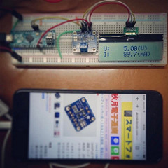

ina219_test.ino
====
Sample arduino sketch for INA219 Current Sensor.

- INA219 High Side DC Current Sensor Breakout - 26V ±3.2A Max
  - https://www.adafruit.com/products/904
  - http://akizukidenshi.com/catalog/g/gM-08221/

- AE-AQM1602A
  - http://akizukidenshi.com/catalog/g/gK-08896/

Copyright and license
----

Copyright (c) 2017 yoggy

Released under the [MIT license](LICENSE.txt)